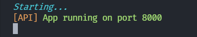

## Getting Started
### Must Install:
- [Node.JS](https://nodejs.org)
- [NPM](https://npmjs.com)

### Clone the repository:
```bash
git clone https://github.com/TheInsanec0der/api.git
```
### Install the dependencies:
```bash
npm install
```
### Environment Variables:
#### Create a `.env` file:
```js
PORT = 8000
MONGO_URI = Your MongoDB URI
```
### Run the project:
```js
npm start
```
<p align="center"><b>OR</b></p>
<p align="center"><b>Double click the <code>run.bat</code> file.</b></p>


Output in console:
<br>


## Contributing
PRs are always welcomed! 🙂

- Fork this repository.
- Make your changes in the fork
- Create a pull request.
